# 🌟 The Ultimate Guide to Roo Modes

> **Interactive Guide to Usage, Management, Development, Architecture & Deployment**

## 📚 Table of Contents

- [Introduction](#introduction)
- [SPARC Methodology Overview](#sparc-methodology-overview)
- [Mode System Architecture](#mode-system-architecture)
- [Available Modes](#available-modes)
- [Using Modes Effectively](#using-modes-effectively)
- [Task Management with `new_task`](#task-management-with-new_task)
- [Workflow Patterns](#workflow-patterns)
- [Development Guide](#development-guide)
- [Deployment Considerations](#deployment-considerations)
- [Customizing Modes](#customizing-modes)
- [Troubleshooting](#troubleshooting)
- [Best Practices](#best-practices)

## 🚀 Introduction

The `.roomodes` file is the heart of the Roo AI assistant's specialized capabilities. It defines a collection of "modes" that transform Roo into purpose-built AI specialists, each with unique skills, permissions, and behaviors.

This guide will help you understand:
- How the mode system works
- When and how to use each mode
- How to manage complex workflows with task delegation
- Best practices for development and deployment

> 💡 **Key Concept**: Modes are specialized AI personas with specific capabilities, access controls, and expertise areas.

## ⚡️ SPARC Methodology Overview

The SPARC methodology is a structured approach to software development that breaks complex tasks into manageable, specialized phases:


### The SPARC Process

1. **S**pecification: Define requirements, constraints, and objectives
2. **P**seudocode: Create logical flow and structure before implementation
3. **A**rchitecture: Design system components, interfaces, and data flows
4. **R**efinement: Implement, test, debug, and optimize
5. **C**ompletion: Integrate, document, deploy, and monitor

> 🔑 **Core Principles**: Modularity, Security, Testability, and Maintainability

## 🏗️ Mode System Architecture

The mode system is built on a JSON configuration structure that defines specialized AI personas:


### Configuration Structure

Each mode is defined with:

- **slug**: Unique identifier (e.g., "architect")
- **name**: Display name with emoji (e.g., "🏗️ Architect")
- **roleDefinition**: Core purpose and capabilities
- **customInstructions**: Detailed behavior guidelines
- **groups**: Tool access permissions
- **source**: Origin of the mode definition

### Tool Access Control

Tool access is managed through the `groups` property, which can include:
- Simple access: `["read", "edit"]`
- Restricted access: `[["edit", { "fileRegex": "\\.md$", "description": "Markdown files only" }]]`

## 🧩 Available Modes

### ⚡️ SPARC Orchestrator
The central coordinator that breaks down complex tasks and delegates to specialist modes.

**Key Responsibilities:**
- Task decomposition and delegation
- Workflow orchestration
- Quality assurance
- Cross-mode coordination

**When to Use:**
- Starting new projects
- Managing complex, multi-stage tasks
- Coordinating between multiple specialists

### 📋 Specification Writer
Captures requirements and translates them into structured pseudocode.

**Key Responsibilities:**
- Requirement analysis
- Edge case identification
- Pseudocode creation
- Test anchor definition

**When to Use:**
- Beginning new features
- Documenting complex logic
- Planning implementation approach

### 🏗️ Architect
Designs system structures, interfaces, and data flows.

**Key Responsibilities:**
- System design
- Component relationships
- API definitions
- Data flow mapping

**When to Use:**
- Planning new systems
- Redesigning existing components
- Defining service boundaries

### 🧠 Auto-Coder
Implements clean, modular code based on specifications and architecture.

**Key Responsibilities:**
- Code implementation
- Environment configuration
- Modular development
- Clean architecture

**When to Use:**
- Implementing features
- Refactoring code
- Building from specifications

### 🧪 Tester (TDD)
Applies test-driven development principles.

**Key Responsibilities:**
- Test-first development
- Test coverage
- Refactoring
- Quality assurance

**When to Use:**
- Starting new features (test first)
- Ensuring code quality
- Fixing bugs with regression tests

### 🪲 Debugger
Troubleshoots and resolves issues in existing code.

**Key Responsibilities:**
- Issue diagnosis
- Root cause analysis
- Fix implementation
- Regression prevention

**When to Use:**
- Investigating failures
- Resolving runtime issues
- Fixing integration problems

### 🛡️ Security Reviewer
Audits code for security vulnerabilities and best practices.

**Key Responsibilities:**
- Security auditing
- Vulnerability detection
- Mitigation recommendations
- Configuration review

**When to Use:**
- Before deployment
- After adding sensitive features
- Regular security checks

### 📚 Documentation Writer
Creates clear, comprehensive documentation.

**Key Responsibilities:**
- Technical documentation
- User guides
- API references
- Setup instructions

**When to Use:**
- After feature completion
- When updating interfaces
- For knowledge transfer

### 🔗 System Integrator
Connects components into cohesive systems.

**Key Responsibilities:**
- Component integration
- Interface compatibility
- System cohesion
- Deployment preparation

**When to Use:**
- Combining multiple components
- Preparing for deployment
- Resolving integration issues

### 📈 Deployment Monitor
Observes system behavior post-deployment.

**Key Responsibilities:**
- Metrics configuration
- Log analysis
- Performance monitoring
- Issue detection

**When to Use:**
- After deployment
- During performance testing
- For ongoing maintenance

### 🧹 Optimizer
Improves existing code for performance and maintainability.

**Key Responsibilities:**
- Performance optimization
- Code refactoring
- Dependency management
- Technical debt reduction

**When to Use:**
- After initial implementation
- When performance issues arise
- For maintenance cycles

### ❓ Ask
Guides users to the appropriate specialist modes.

**Key Responsibilities:**
- Task analysis
- Mode recommendation
- Query formulation
- SPARC methodology guidance

**When to Use:**
- When unsure which mode to use
- For complex, multi-faceted requests
- To learn about the SPARC system

### 🚀 DevOps
Manages deployment, infrastructure, and operations.

**Key Responsibilities:**
- Infrastructure provisioning
- Deployment automation
- Environment configuration
- Monitoring setup

**When to Use:**
- Setting up infrastructure
- Deploying applications
- Configuring environments
- Automating operations

### 📘 SPARC Tutorial
Educates users on the SPARC methodology and mode system.

**Key Responsibilities:**
- SPARC methodology education
- Mode system explanation
- Best practice guidance
- Workflow demonstration

**When to Use:**
- When new to the SPARC system
- To learn effective workflows
- For team onboarding

## 🔄 Using Modes Effectively

### Mode Switching

To switch between modes, use the `switch_mode` tool:

```
<switch_mode>
  <mode_slug>architect</mode_slug>
</switch_mode>
```

### Mode Selection Guidelines

Choose the appropriate mode based on your current task phase:


### Mode Transition Patterns

Effective workflows often follow these transition patterns:

1. **New Feature Flow**:
   ```
   ask → sparc → spec-pseudocode → architect → code → tdd → security-review → docs-writer → integration → devops
   ```

2. **Bug Fix Flow**:
   ```
   ask → debug → tdd → code → integration
   ```

3. **Performance Improvement Flow**:
   ```
   ask → post-deployment-monitoring-mode → refinement-optimization-mode → code → tdd → integration
   ```

## 📋 Task Management with `new_task`

The `new_task` tool allows modes to delegate specialized subtasks to other modes.

### Task Delegation Syntax

```
<new_task>
  <title>Implement user authentication</title>
  <description>Create a secure authentication system with JWT</description>
  <mode>code</mode>
</new_task>
```

### Task Completion

All tasks should conclude with the `attempt_completion` tool:

```
<attempt_completion>
  <result>
    Successfully implemented user authentication with JWT.
    - Created auth middleware
    - Added token validation
    - Implemented refresh token flow
  </result>
</attempt_completion>
```

### Task Delegation Patterns


## 🛠️ Development Guide

### Adding New Modes

To add a custom mode, extend the `.roomodes` file with a new entry:

```json
{
  "slug": "custom-mode",
  "name": "🔮 Custom Mode",
  "roleDefinition": "Purpose and capabilities description",
  "customInstructions": "Detailed behavior guidelines",
  "groups": ["read", "edit"],
  "source": "project"
}
```

### Modifying Existing Modes

To modify an existing mode, update its properties in the `.roomodes` file.

### Tool Group Configuration

Tool groups control what actions a mode can perform:

- **read**: File system reading capabilities
- **edit**: File modification capabilities
- **browser**: Web interaction capabilities
- **command**: System command execution
- **mcp**: External tool integration

### Restricted Tool Access

For fine-grained control, use the array syntax with restrictions:

```json
"groups": [
  "read",
  ["edit", {
    "fileRegex": "\\.md$",
    "description": "Markdown files only"
  }]
]
```

## 🚢 Deployment Considerations

### Environment Setup

Ensure your deployment environment supports:

1. File system access for relevant modes
2. Command execution for DevOps and integration modes
3. Network access for browser and MCP tools

### Security Considerations

- Restrict command execution to trusted environments
- Use file path restrictions to prevent unauthorized access
- Implement proper authentication for sensitive operations

### CI/CD Integration

Incorporate mode-specific workflows in your CI/CD pipeline:


## 🔧 Customizing Modes

### Custom Instructions

Tailor mode behavior with the `customInstructions` property:

```json
"customInstructions": "Follow these specific guidelines...\n\n1. Always do X\n2. Never do Y\n3. Prioritize Z"
```

### Custom Tool Restrictions

Create specialized tool access patterns:

```json
"groups": [
  ["command", {
    "allowedCommands": ["npm", "yarn", "git"],
    "description": "Package and version control commands only"
  }]
]
```

## ❓ Troubleshooting

### Common Issues

| Issue | Solution |
|-------|----------|
| Mode cannot access files | Check the mode's `groups` configuration for proper read/edit access |
| Mode cannot execute commands | Verify command group access and any restrictions |
| Mode behavior is incorrect | Review and update the `customInstructions` property |
| Task delegation fails | Ensure the target mode exists and is properly configured |

### Diagnostic Steps

1. Verify mode configuration in `.roomodes`
2. Check tool access permissions
3. Review custom instructions for conflicts
4. Ensure proper mode switching syntax

## ✅ Best Practices

### Core Principles

Always adhere to these fundamental principles:

- **Modularity**: Keep components small and focused
- **Security**: Never hardcode secrets or credentials
- **File Size**: Maintain files under 500 lines
- **Task Completion**: Always use `attempt_completion`

### Workflow Optimization

- Use the most specialized mode for each task
- Delegate subtasks to appropriate modes
- Follow the SPARC methodology sequence
- Document mode transitions for complex workflows

### Documentation Standards

- Create comprehensive documentation with the docs-writer mode
- Include diagrams for complex systems
- Document API interfaces and data structures
- Provide usage examples for all components

## 🔄 Mode Interaction Map

```mermaid
graph TD
    SPARC[⚡️ SPARC Orchestrator] --> SpecWriter[📋 Specification Writer]
    SPARC --> Architect[🏗️ Architect]
    SPARC --> Coder[🧠 Auto-Coder]
    SPARC --> Tester[🧪 Tester]
    SPARC --> Debugger[🪲 Debugger]
    SPARC --> Security[🛡️ Security Reviewer]
    SPARC --> DocsWriter[📚 Documentation Writer]
    SPARC --> Integrator[🔗 System Integrator]
    SPARC --> Monitor[📈 Deployment Monitor]
    SPARC --> Optimizer[🧹 Optimizer]
    SPARC --> DevOps[🚀 DevOps]
    
    Ask[❓ Ask] --> SPARC
    
    SpecWriter --> Architect
    Architect --> Coder
    Coder --> Tester
    Tester --> Debugger
    Debugger --> Security
    Security --> DocsWriter
    DocsWriter --> Integrator
    Integrator --> DevOps
    DevOps --> Monitor
    Monitor --> Optimizer
    
    Tutorial[📘 SPARC Tutorial] -.-> Ask
```



---

## 🎓 Conclusion

The Roo Modes system provides a powerful framework for specialized AI assistance across the entire software development lifecycle. By understanding and effectively utilizing the various modes, you can create more efficient, secure, and maintainable software with AI collaboration.

Remember the core principles:
- 🧩 **Modularity**: Keep components focused and manageable
- 🔒 **Security**: Protect sensitive information
- 📏 **Size limits**: Maintain readable, manageable files
- ✅ **Task completion**: Always provide clear outcomes

For more information, consult the [SPARC Tutorial mode](#) or ask the [Ask mode](#) for guidance on your specific needs.

---

*This guide was created by the 📚 Documentation Writer mode. Last updated: April 2025*